# 🌊 Theareasastr - System Diagrams (Mermaid)

This document contains Mermaid diagram code for visualizing the Theareasastr IoT Water Level Monitoring System.

> **Note:** These diagrams can be rendered in:
>
> - GitHub (native support)
> - VS Code with Mermaid extension
> - [Mermaid Live Editor](https://mermaid.live)
> - Notion, Obsidian, and other Markdown editors

---

## Table of Contents

1. [System Architecture Overview](#1-system-architecture-overview)
2. [Hardware Network Topology](#2-hardware-network-topology)
3. [Data Flow Pipeline](#3-data-flow-pipeline)
4. [Sensor Node Firmware Flowchart](#4-sensor-node-firmware-flowchart)
5. [Gateway Station Firmware Flowchart](#5-gateway-station-firmware-flowchart)
6. [Pump Controller Firmware Flowchart](#6-pump-controller-firmware-flowchart)
7. [Frontend Application Architecture](#7-frontend-application-architecture)
8. [Database Schema (ERD)](#8-database-schema-erd)
9. [Alert System Flow](#9-alert-system-flow)
10. [Flood Risk Prediction Algorithm](#10-flood-risk-prediction-algorithm)
11. [User Journey Flow](#11-user-journey-flow)
12. [Deployment Architecture](#12-deployment-architecture)
13. [Sequence Diagrams](#13-sequence-diagrams)

---

## 1. System Architecture Overview

### High-Level Architecture

```mermaid
flowchart TB
    subgraph EDGE["🔧 Edge Layer (Field Devices)"]
        N1[("🌊 Sensor Node 1<br/>ESP32 + LoRa + Ultrasonic")]
        N2[("🌊 Sensor Node 2<br/>ESP32 + LoRa + Ultrasonic")]
        PUMP[("⚡ Pump Controller<br/>ESP32 + WiFi + Relay")]
    end

    subgraph GATEWAY["📡 Gateway Layer"]
        STATION[("🖥️ Gateway Station<br/>ESP32 + LoRa + WiFi")]
    end

    subgraph CLOUD["☁️ Cloud Layer"]
        SUPABASE[("🗄️ Supabase<br/>PostgreSQL + Realtime")]
        TELEGRAM[("📱 Telegram Bot API")]
    end

    subgraph APP["💻 Application Layer"]
        DASHBOARD[("🖥️ Next.js Dashboard<br/>React + TypeScript")]
    end

    N1 -->|"LoRa 433MHz"| STATION
    N2 -->|"LoRa 433MHz"| STATION
    STATION -->|"HTTPS/REST"| SUPABASE
    STATION -->|"HTTPS"| TELEGRAM
    SUPABASE <-->|"WebSocket + REST"| DASHBOARD
    DASHBOARD -->|"REST API"| SUPABASE
    SUPABASE -->|"State Change"| PUMP
    PUMP -->|"HTTP Polling"| SUPABASE

    style EDGE fill:#1a1a2e,stroke:#00d4ff,color:#fff
    style GATEWAY fill:#16213e,stroke:#00d4ff,color:#fff
    style CLOUD fill:#0f3460,stroke:#00d4ff,color:#fff
    style APP fill:#1a1a2e,stroke:#00d4ff,color:#fff
```



### Simplified Block Diagram

```mermaid
graph LR
    A[🌊 Ultrasonic<br/>Sensor] --> B[📟 ESP32<br/>Sensor Node]
    B -->|LoRa| C[📡 ESP32<br/>Gateway]
    C -->|WiFi/HTTPS| D[(🗄️ Supabase<br/>Database)]
    D -->|WebSocket| E[🖥️ Next.js<br/>Dashboard]
    D -->|REST| F[⚡ Pump<br/>Controller]
    C -->|HTTPS| G[📱 Telegram<br/>Bot]

    style A fill:#4ecdc4,stroke:#1a1a2e,color:#000
    style B fill:#ff6b6b,stroke:#1a1a2e,color:#fff
    style C fill:#feca57,stroke:#1a1a2e,color:#000
    style D fill:#5f27cd,stroke:#1a1a2e,color:#fff
    style E fill:#00d2d3,stroke:#1a1a2e,color:#000
    style F fill:#ff9f43,stroke:#1a1a2e,color:#000
    style G fill:#54a0ff,stroke:#1a1a2e,color:#fff
```



---

## 2. Hardware Network Topology

```mermaid
graph TB
    subgraph FIELD["📍 Field Installation"]
        subgraph TANK1["Water Tank 1"]
            US1[("HC-SR04<br/>Ultrasonic")]
            ESP1["ESP32 + SX1262<br/>Node 1"]
            US1 --> ESP1
        end

        subgraph TANK2["Water Tank 2"]
            US2[("HC-SR04<br/>Ultrasonic")]
            ESP2["ESP32 + SX1262<br/>Node 2"]
            US2 --> ESP2
        end

        subgraph PUMPHOUSE["Pump House"]
            RELAY["Relay Module"]
            ESP_PUMP["ESP32<br/>Pump Controller"]
            ESP_PUMP --> RELAY
            RELAY --> MOTOR[("💧 Water Pump")]
        end
    end

    subgraph CONTROL["🏠 Control Room"]
        LORA_RX["SX1262<br/>LoRa Receiver"]
        ESP_GW["ESP32<br/>Gateway"]
        WIFI["WiFi<br/>Module"]
        LORA_RX --> ESP_GW
        ESP_GW --> WIFI
    end

    subgraph NETWORK["🌐 Network"]
        ROUTER["WiFi Router"]
        INTERNET(("☁️ Internet"))
    end

    ESP1 -.->|"LoRa 433MHz<br/>~2km range"| LORA_RX
    ESP2 -.->|"LoRa 433MHz<br/>~2km range"| LORA_RX
    WIFI --> ROUTER
    ESP_PUMP --> ROUTER
    ROUTER --> INTERNET

    style FIELD fill:#e8f5e9,stroke:#2e7d32
    style CONTROL fill:#e3f2fd,stroke:#1565c0
    style NETWORK fill:#fff3e0,stroke:#ef6c00
```



### Pin Configuration Diagram


---

## 3. Data Flow Pipeline

### Complete Data Pipeline


### Real-time Data Flow


---

## 4. Sensor Node Firmware Flowchart

```mermaid
flowchart TD
    START([🚀 START]) --> INIT_SERIAL["Initialize Serial<br/>115200 baud"]
    INIT_SERIAL --> INIT_PINS["Configure GPIO Pins<br/>TRIG=6, ECHO=5"]
    INIT_PINS --> INIT_SPI["Initialize SPI Bus<br/>SCK=9, MISO=11, MOSI=10"]
    INIT_SPI --> INIT_LORA["Initialize LoRa Radio<br/>433MHz, SF12, 500kHz BW"]

    INIT_LORA --> LORA_OK{LoRa Init<br/>Success?}
    LORA_OK -->|No| ERROR["Print Error<br/>Halt"]
    LORA_OK -->|Yes| READY["Print: Ready"]

    READY --> LOOP_START([🔄 LOOP START])

    LOOP_START --> TRIG_LOW["Set TRIG LOW<br/>2µs delay"]
    TRIG_LOW --> TRIG_HIGH["Set TRIG HIGH<br/>10µs pulse"]
    TRIG_HIGH --> TRIG_LOW2["Set TRIG LOW"]
    TRIG_LOW2 --> READ_ECHO["Read ECHO pulse<br/>pulseIn()"]

    READ_ECHO --> CALC_DIST["Calculate Distance<br/>dist = duration × 0.034 / 2"]
    CALC_DIST --> CALC_LEVEL["Calculate Water Level<br/>level = TANK_HEIGHT - dist"]

    CALC_LEVEL --> FORMAT["Format Packet<br/>'NODE_ID|level cm'"]
    FORMAT --> TRANSMIT["LoRa Transmit<br/>radio.transmit()"]

    TRANSMIT --> TX_OK{Transmit<br/>Success?}
    TX_OK -->|Yes| PRINT_OK["Print: Sent"]
    TX_OK -->|No| PRINT_FAIL["Print: TX Failed"]

    PRINT_OK --> DELAY["Delay 2-3 seconds"]
    PRINT_FAIL --> DELAY
    DELAY --> LOOP_START

    style START fill:#4caf50,stroke:#2e7d32,color:#fff
    style ERROR fill:#f44336,stroke:#c62828,color:#fff
    style LOOP_START fill:#2196f3,stroke:#1565c0,color:#fff
```



---

## 5. Gateway Station Firmware Flowchart


---

## 6. Pump Controller Firmware Flowchart

```mermaid
flowchart TD
    START([🚀 START]) --> INIT_SERIAL["Initialize Serial"]
    INIT_SERIAL --> INIT_GPIO["Configure GPIO 4<br/>as OUTPUT"]
    INIT_GPIO --> LED_OFF["Set LED/Relay OFF"]

    LED_OFF --> INIT_WIFI["Connect to WiFi"]
    INIT_WIFI --> WIFI_OK{WiFi<br/>Connected?}
    WIFI_OK -->|No| RETRY["Retry in 1s"]
    RETRY --> INIT_WIFI
    WIFI_OK -->|Yes| PRINT_IP["Print IP Address"]

    PRINT_IP --> LOOP([🔄 LOOP])

    LOOP --> CHECK_TIMER{2 seconds<br/>elapsed?}
    CHECK_TIMER -->|No| DELAY["Delay 1s"]
    DELAY --> LOOP

    CHECK_TIMER -->|Yes| HTTP_GET["HTTP GET<br/>/device_control?select=led"]

    HTTP_GET --> HTTP_OK{HTTP<br/>Success?}
    HTTP_OK -->|No| PRINT_HTTP_ERR["Print HTTP Error"]
    HTTP_OK -->|Yes| PARSE_JSON["Parse JSON Response"]

    PARSE_JSON --> EXTRACT["Extract 'led' value"]

    EXTRACT --> LED_STATE{led == true?}
    LED_STATE -->|Yes| LED_ON["Set GPIO 4 HIGH<br/>(Pump ON)"]
    LED_STATE -->|No| LED_OFF2["Set GPIO 4 LOW<br/>(Pump OFF)"]

    LED_ON --> PRINT_STATE["Print: Pump ON"]
    LED_OFF2 --> PRINT_STATE2["Print: Pump OFF"]

    PRINT_STATE --> RESET_TIMER["Reset Timer"]
    PRINT_STATE2 --> RESET_TIMER
    PRINT_HTTP_ERR --> RESET_TIMER
    RESET_TIMER --> LOOP

    style START fill:#4caf50,stroke:#2e7d32,color:#fff
    style LOOP fill:#2196f3,stroke:#1565c0,color:#fff
    style LED_ON fill:#ff9800,stroke:#f57c00,color:#fff
    style LED_OFF2 fill:#607d8b,stroke:#455a64,color:#fff
```



---

## 7. Frontend Application Architecture

### Component Hierarchy


### Page Routing


---

## 8. Database Schema (ERD)


### Table Relationships

```mermaid
graph TB
    subgraph DATABASE["🗄️ Supabase PostgreSQL"]
        WL["water_levels<br/>━━━━━━━━━━<br/>id (PK)<br/>device_id<br/>water_level<br/>created_at"]
        DC["device_control<br/>━━━━━━━━━━<br/>id (PK)<br/>led<br/>pump_mode<br/>auto_enabled"]
        DL["device_locations<br/>━━━━━━━━━━<br/>device_id (PK)<br/>latitude<br/>longitude<br/>name"]
    end

    WL -.->|"device_id"| DL
    DC -.->|"controls"| WL

    style DATABASE fill:#5f27cd,stroke:#341f97,color:#fff
    style WL fill:#00d2d3,stroke:#01a3a4,color:#000
    style DC fill:#ff9f43,stroke:#ee5a24,color:#000
    style DL fill:#54a0ff,stroke:#2e86de,color:#fff
```



---

## 9. Alert System Flow

```mermaid
flowchart TD
    START([📊 New Reading]) --> CHECK_HIGH{Level ><br/>HIGH_THRESHOLD?}

    CHECK_HIGH -->|Yes| HIGH_ALERT["🔴 Generate HIGH Alert"]
    CHECK_HIGH -->|No| CHECK_LOW{Level <<br/>LOW_THRESHOLD?}

    CHECK_LOW -->|Yes| LOW_ALERT["🟡 Generate LOW Alert"]
    CHECK_LOW -->|No| CHECK_RATE{Change Rate ><br/>CRITICAL_RATE?}

    CHECK_RATE -->|Yes| RAPID_ALERT["🔴 Generate RAPID RISE Alert"]
    CHECK_RATE -->|No| CHECK_WARN{Change Rate ><br/>WARNING_RATE?}

    CHECK_WARN -->|Yes| WARN_ALERT["🟡 Generate WARNING Alert"]
    CHECK_WARN -->|No| SAFE["✅ Status: SAFE"]

    HIGH_ALERT --> CHECK_COOLDOWN{Cooldown<br/>Active?}
    LOW_ALERT --> CHECK_COOLDOWN
    RAPID_ALERT --> CHECK_COOLDOWN
    WARN_ALERT --> CHECK_COOLDOWN

    CHECK_COOLDOWN -->|Yes| SKIP["Skip Notification"]
    CHECK_COOLDOWN -->|No| SEND_TELEGRAM["📱 Send Telegram Alert"]

    SEND_TELEGRAM --> SET_COOLDOWN["Set 5min Cooldown"]
    SET_COOLDOWN --> UPDATE_UI["Update Dashboard UI"]
    SKIP --> UPDATE_UI
    SAFE --> UPDATE_UI

    UPDATE_UI --> END([✅ Complete])

    style START fill:#4caf50,stroke:#2e7d32,color:#fff
    style HIGH_ALERT fill:#f44336,stroke:#c62828,color:#fff
    style LOW_ALERT fill:#ff9800,stroke:#f57c00,color:#fff
    style RAPID_ALERT fill:#f44336,stroke:#c62828,color:#fff
    style WARN_ALERT fill:#ff9800,stroke:#f57c00,color:#fff
    style SAFE fill:#4caf50,stroke:#2e7d32,color:#fff
    style SEND_TELEGRAM fill:#2196f3,stroke:#1565c0,color:#fff
```



### Alert Severity Matrix

```mermaid
quadrantChart
    title Alert Severity Based on Level and Rate
    x-axis Low Level --> High Level
    y-axis Slow Rate --> Fast Rate
    quadrant-1 🔴 CRITICAL
    quadrant-2 🟡 WARNING
    quadrant-3 ✅ SAFE
    quadrant-4 🟡 WARNING

    "High + Fast": [0.9, 0.9]
    "High + Slow": [0.9, 0.2]
    "Low + Fast": [0.2, 0.9]
    "Normal": [0.5, 0.3]
```



---

## 10. Flood Risk Prediction Algorithm

```mermaid
flowchart TD
    START([📥 Input: Recent Readings]) --> CALC_RATE["Calculate Change Rate<br/>rate = (current - previous) / time"]

    CALC_RATE --> EXTRAPOLATE["Linear Extrapolation<br/>predicted_30m = current + rate × 30<br/>predicted_60m = current + rate × 60"]

    EXTRAPOLATE --> CHECK_CRITICAL{current ≥ 180<br/>OR rate ≥ 2.0?}

    CHECK_CRITICAL -->|Yes| CRITICAL["🔴 CRITICAL<br/>Immediate danger"]
    CHECK_CRITICAL -->|No| CHECK_WARNING{current ≥ 150<br/>OR rate ≥ 0.5?}

    CHECK_WARNING -->|Yes| WARNING["🟡 WARNING<br/>Monitor closely"]
    CHECK_WARNING -->|No| SAFE["✅ SAFE<br/>Normal operation"]

    CRITICAL --> FACTORS["Identify Risk Factors"]
    WARNING --> FACTORS
    SAFE --> FACTORS

    FACTORS --> OUTPUT["📤 Output:<br/>- Risk Level<br/>- Current Level<br/>- Change Rate<br/>- Predictions (30m, 60m)<br/>- Confidence Score<br/>- Risk Factors"]

    style START fill:#4caf50,stroke:#2e7d32,color:#fff
    style CRITICAL fill:#f44336,stroke:#c62828,color:#fff
    style WARNING fill:#ff9800,stroke:#f57c00,color:#fff
    style SAFE fill:#4caf50,stroke:#2e7d32,color:#fff
    style OUTPUT fill:#2196f3,stroke:#1565c0,color:#fff
```



### Risk Level State Machine

```mermaid
stateDiagram-v2
    [*] --> SAFE

    SAFE --> WARNING : Level > 150 OR Rate > 0.5
    SAFE --> CRITICAL : Level > 180 OR Rate > 2.0

    WARNING --> SAFE : Level < 140 AND Rate < 0.3
    WARNING --> CRITICAL : Level > 180 OR Rate > 2.0

    CRITICAL --> WARNING : Level < 170 AND Rate < 1.5
    CRITICAL --> SAFE : Level < 140 AND Rate < 0.3

    SAFE : ✅ Normal Operation
    SAFE : No alerts needed

    WARNING : ⚠️ Monitor Closely
    WARNING : Send warning alert

    CRITICAL : 🚨 Immediate Action
    CRITICAL : Send critical alert
    CRITICAL : Consider evacuation
```



---

## 11. User Journey Flow


### User Interface Flow


---

## 12. Deployment Architecture


---

## 13. Sequence Diagrams

### Complete Data Flow Sequence

```mermaid
sequenceDiagram
    autonumber
    participant US as 🔬 Ultrasonic
    participant SN as 📟 Sensor Node
    participant GW as 📡 Gateway
    participant DB as 🗄️ Supabase
    participant RT as ⚡ Realtime
    participant UI as 🖥️ Dashboard
    participant TG as 📱 Telegram

    rect rgb(200, 230, 200)
        Note over US,SN: Sensing Phase
        SN->>US: Trigger pulse (10µs)
        US-->>SN: Echo return
        SN->>SN: Calculate distance
        SN->>SN: Calculate water level
    end

    rect rgb(200, 200, 230)
        Note over SN,GW: Transmission Phase
        SN->>GW: LoRa packet "1|45.2 cm"
        GW->>GW: Parse packet
        GW->>GW: Build JSON
    end

    rect rgb(230, 200, 230)
        Note over GW,DB: Storage Phase
        GW->>DB: POST /water_levels
        DB->>DB: INSERT record
        DB-->>GW: 201 Created
    end

    rect rgb(230, 230, 200)
        Note over DB,UI: Display Phase
        DB->>RT: Trigger subscription
        RT->>UI: WebSocket push
        UI->>UI: Update components
    end

    rect rgb(230, 200, 200)
        Note over DB,TG: Alert Phase (if threshold exceeded)
        DB->>DB: Check thresholds
        alt Level > HIGH_THRESHOLD
            DB->>TG: Send alert
            TG-->>TG: Deliver to user
        end
    end
```

### Pump Control Sequence

```mermaid
sequenceDiagram
    autonumber
    participant U as 👤 User
    participant UI as 🖥️ Dashboard
    participant DB as 🗄️ Supabase
    participant PC as ⚡ Pump Controller
    participant P as 💧 Pump

    U->>UI: Click "PUMP OUT"
    UI->>DB: PATCH /device_control {led: true}
    DB-->>UI: 200 OK
    UI->>UI: Update button state

    loop Every 2 seconds
        PC->>DB: GET /device_control?select=led
        DB-->>PC: {led: true}
        PC->>PC: Parse response
        PC->>P: Set GPIO HIGH
        Note over P: Pump running
    end

    U->>UI: Click "DISENGAGE"
    UI->>DB: PATCH /device_control {led: false}
    DB-->>UI: 200 OK

    PC->>DB: GET /device_control?select=led
    DB-->>PC: {led: false}
    PC->>P: Set GPIO LOW
    Note over P: Pump stopped
```

### Report Generation Sequence

```mermaid
sequenceDiagram
    autonumber
    participant U as 👤 User
    participant UI as 🖥️ Reports Page
    participant H as 🪝 useGenerateReport
    participant DB as 🗄️ Supabase
    participant API as 🔌 /api/telegram
    participant TG as 📱 Telegram

    U->>UI: Open Reports Page
    UI->>H: Initialize hook
    H->>DB: Query water_levels (24h)
    DB-->>H: Return readings[]
    H->>H: Calculate statistics
    H->>H: Detect anomalies
    H-->>UI: Return report object

    UI->>UI: Display report card

    U->>UI: Click "TRANSMIT"
    UI->>API: POST /api/telegram
    API->>API: Format message (HTML)
    API->>TG: Send message
    TG-->>API: 200 OK
    API-->>UI: {success: true}
    UI->>UI: Show success toast
```

---

## How to Use These Diagrams

### Rendering in GitHub

Simply commit this file to your repository. GitHub will automatically render the Mermaid diagrams.

### Rendering in VS Code

1. Install the "Markdown Preview Mermaid Support" extension
2. Open this file and press `Ctrl+Shift+V` (or `Cmd+Shift+V` on Mac)

### Rendering Online

1. Go to [Mermaid Live Editor](https://mermaid.live)
2. Copy any diagram code block (without the ```mermaid wrapper)
3. Paste into the editor

### Exporting as Images

In Mermaid Live Editor, you can export diagrams as:

- PNG
- SVG
- PDF

---

## Quick Reference: Mermaid Syntax

```markdown
# Flowchart

flowchart TD
A[Rectangle] --> B{Diamond}
B -->|Yes| C((Circle))
B -->|No| D[(Database)]

# Sequence Diagram

sequenceDiagram
Alice->>Bob: Hello
Bob-->>Alice: Hi

# Class Diagram

classDiagram
class Animal {
+name: string
+age: int
+eat()
}

# State Diagram

stateDiagram-v2
[*] --> State1
State1 --> State2
State2 --> [*]

# ER Diagram

erDiagram
CUSTOMER ||--o{ ORDER : places
ORDER ||--|{ LINE-ITEM : contains
```

---

_Diagrams created for Theareasastr IoT Water Level Monitoring System v1.0.0_
